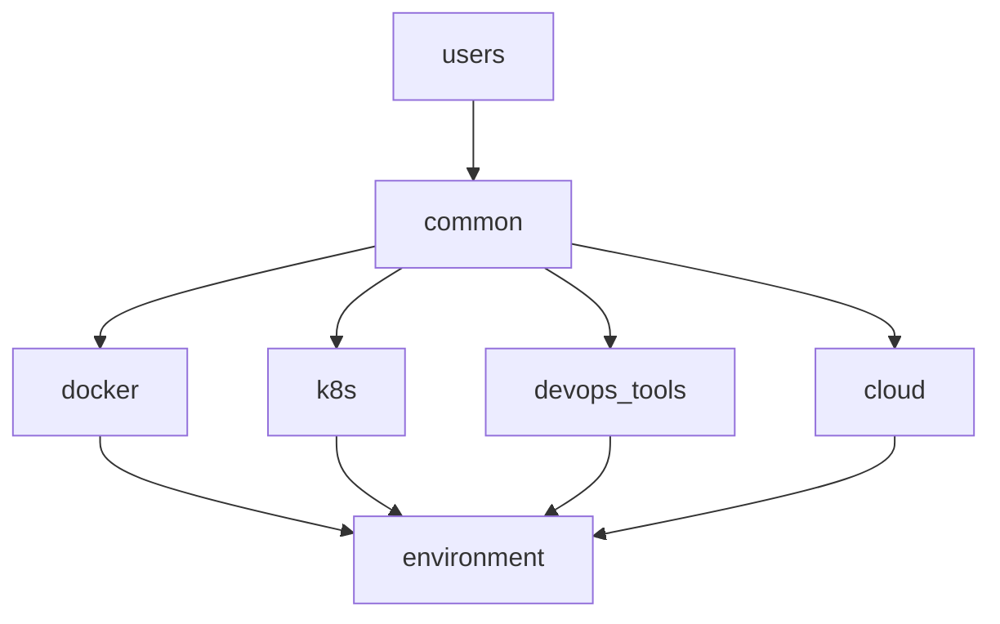

# Role Documentation

Detailed documentation for all Ansible roles.

## Role Index

- [users](#users) - User management with sudo control
- [environment](#environment) - Shell environment configuration
- [common](#common) - Base packages and utilities
- [docker](#docker) - Docker and Docker Compose
- [k8s](#k8s) - Kubernetes tools
- [devops_tools](#devops_tools) - GitOps and DevOps tools
- [cloud](#cloud) - Cloud provider tools

---

## users

**Purpose**: Create and manage system users with fine-grained sudo permissions

**Location**: `roles/users/`

### What It Does

- Creates system users
- Configures sudo permissions (full or command-specific)
- Manages SSH authorized keys
- Sets up user groups and shells

### Default Users

| User    | Purpose            | Sudo                  | Groups |
| ------- | ------------------ | --------------------- | ------ |
| deploy  | CI/CD deployments  | Full (with password)  | docker |
| jenkins | Jenkins automation | Limited (no password) | docker |

### Configuration

```yaml
# roles/users/defaults/main.yml
system_users:
  - name: myuser
    comment: "My User"
    shell: /bin/bash
    groups: [docker]
    sudo_enabled: true
    sudo_nopasswd: false
    sudo_commands: []
    ssh_keys: []
```

### Files

- `tasks/create_users.yml` - User creation
- `tasks/sudo_config.yml` - Sudo permissions
- `tasks/ssh_keys.yml` - SSH key management  
- `templates/sudoers.j2` - Sudo template

📖 [Full User Management Guide](USER_MANAGEMENT.md)

---

## environment

**Purpose**: Configure shell environment with aliases, completions, and helper functions

**Location**: `roles/environment/`

### What It Does

- Configures .bashrc with aliases and environment variables
- Installs kubectl aliases
- Sets up bash completions
- Adds Kubernetes helper functions
- Creates example Kluctl project

### Features

**Aliases**:
- Kubernetes: `k`, `kg`, `kd`, `kl`, `kaf`, `kdf`
- Docker: `d`, `dc`, `dps`, `dimg`
- Tools: `tf`, `h`, `hf`, `kctl`

**Helper Functions**:
- `kexec <pod>` - Execute into pod
- `klogs <pod>` - Follow pod logs
- `kport <svc>` - Port forward
- `cluster-info` - Show cluster details
- `decode-secret` - Decode secrets

### Configuration

```yaml
# roles/environment/defaults/main.yml
environment_users: ["{{ ansible_user }}", "deploy"]
environment_configure_bash: true
environment_install_kubectl_aliases: true
environment_create_kluctl_example: true
```

### Files

- `tasks/bash_config.yml` - Bash configuration
- `tasks/helper_functions.yml` - Helper functions
- `templates/k8s-helpers.sh.j2` - K8s helpers template

---

## common

**Purpose**: Install base system packages and CLI utilities

**Location**: `roles/common/`

### What It Installs

**Base Packages**:
- git, curl, wget, vim, nano
- bash-completion, net-tools
- htop, tree, tmux
- Development tools (gcc, make)

**Python Packages**:
- yamllint
- ansible-lint

**Utilities**:
- yq - YAML/JSON processor
- jq - JSON processor
- hadolint - Dockerfile linter
- shellcheck - Shell script linter
- dive - Docker image explorer
- ctop - Container top
- lazydocker - Docker TUI

### Configuration

```yaml
# roles/common/defaults/main.yml
common_install_packages: true
common_install_utilities: true
common_run_verification: false

# Utility versions
yq_version: "4.42.1"
dive_version: "0.12.0"
lazydocker_version: "0.23.1"
```

### Files

- `tasks/pack ages.yml` - System packages
- `tasks/pip.yml` - Python packages
- `tasks/utilities.yml` - CLI utilities
- `tasks/verify.yml` - Verification

---

## docker

**Purpose**: Install and configure Docker and Docker Compose

**Location**: `roles/docker/`

### What It Installs

- Docker Engine
- Docker Compose
- Docker buildx plugin
- Adds users to docker group

### Configuration

```yaml
docker_users:
  - "{{ ansible_user }}"
  - deploy
```

### Post-Installation

Users need to logout/login or run:
```bash
newgrp docker
```

---

## k8s

**Purpose**: Install Kubernetes tools

**Location**: `roles/k8s/`

### What It Installs

- **kubectl** - Kubernetes CLI
- **minikube** - Local Kubernetes
- **stern** - Multi-pod log tailing
- **k9s** - Kubernetes TUI
- **kubectx/kubens** - Context/namespace switching
- **kind** - Kubernetes in Docker
- **skaffold** - Local development

### Configuration

```yaml
# roles/k8s/defaults/main.yml
install_kubectl: true
kubectl_version: "stable"  # or "1.29.0"

install_minikube: true
install_k8s_tools: true

# Tool versions
stern_version: "1.28.0"
k9s_version: "0.31.9"
kubectx_version: "0.9.5"
kind_version: "0.22.0"
```

### Files

- `tasks/kubectl.yml` - kubectl installation
- `tasks/minikube.yml` - Minikube installation
- `tasks/k8s_tools.yml` - Other K8s tools

---

## devops_tools

**Purpose**: Install GitOps and DevOps tools

**Location**: `roles/devops_tools/`

### What It Installs

- **Helm** - Kubernetes package manager
- **Helmfile** - Declarative Helm deployment
- **Kluctl** - GitOps deployments
- **Kustomize** - Kubernetes config management
- **Tilt** - Local development
- **ArgoCD CLI** - GitOps CD tool

### Configuration

```yaml
# roles/devops_tools/defaults/main.yml
install_helm: true
install_helmfile: true
install_kluctl: true
install_kustomize: true
install_tilt: true
install_argocd: true

# Versions
helm_version: "3.14.2"
helmfile_version: "0.162.0"
kluctl_version: "2.23.3"
kustomize_version: "5.3.0"
tilt_version: "0.33.11"
argocd_version: "2.10.1"
```

### Files

- `tasks/helm.yml` - Helm installation
- `tasks/helmfile.yml` - Helmfile installation
- `tasks/kluctl.yml` - Kluctl installation
- `tasks/kustomize.yml` - Kustomize installation
- `tasks/tilt.yml` - Tilt installation
- `tasks/argocd.yml` - ArgoCD CLI installation

---

## cloud

**Purpose**: Install cloud provider and infrastructure tools

**Location**: `roles/cloud/`

### What It Installs

- **AWS CLI v2** - Amazon Web Services CLI
- **Terraform** - Infrastructure as Code
- **Vault** - HashiCorp secrets management

### Configuration

```yaml
# roles/cloud/defaults/main.yml
install_aws_cli: true
install_terraform: true
install_vault: true

# Versions
terraform_version: "1.7.3"
vault_version: "1.15.5"
```

### Post-Installation

Configure AWS CLI:
```bash
aws configure
```

### Files

- `tasks/aws.yml` - AWS CLI installation
- `tasks/terraform.yml` - Terraform installation
- `tasks/vault.yml` - Vault installation

---

## Role Dependencies



Roles run in this order:
1. users (create users first)
2. common (base packages)
3. docker (container tools)
4. k8s (k8s tools)
5. devops_tools (gitops tools)
6. cloud (cloud tools)
7. environment (configure shells last)

---

## Customizing Roles

### Skip a Role

```yaml
# group_vars/all/main.yml
install_kubectl: false  # Skip kubectl
install_terraform: false  # Skip terraform
```

### Override Defaults

Create `group_vars/all/main.yml`:

```yaml
# Override tool versions
terraform_version: "1.6.0"
helm_version: "3.13.0"

# Add custom users
system_users:
  - name: custom_user
    groups: [docker]
```

### Run Specific Roles

```bash
# Only run users and docker roles
ansible-playbook playbooks/site.yml --tags users,docker

# Skip environment role
ansible-playbook playbooks/site.yml --skip-tags environment
```

---

## Testing Roles

### Test Single Role

```bash
# Test users role
ansible-playbook playbooks/site.yml -i inventory/dev --tags users --check

# Test with verbosity
ansible-playbook playbooks/site.yml -i inventory/dev --tags docker -v
```

### Verify Role Installation

```bash
# Run verification playbook
ansible-playbook playbooks/verify.yml -i inventory/dev
```

---

## Troubleshooting

### Role Not Running

1. Check tags:
   ```bash
   ansible-playbook playbooks/site.yml --list-tasks
   ```

2. Check conditions:
   ```bash
   ansible-playbook playbooks/site.yml -i inventory/dev -v
   ```

### Tool Not Installed

1. Check role output for errors
2. Verify version variables are set
3. Check install flags (e.g., `install_kubectl: true`)
4. Re-run specific role

---

## Additional Documentation

- [Getting Started](GETTING_STARTED.md)
- [User Management](USER_MANAGEMENT.md)
- [Configuration](CONFIGURATION.md)
- [Security](SECURITY.md)
